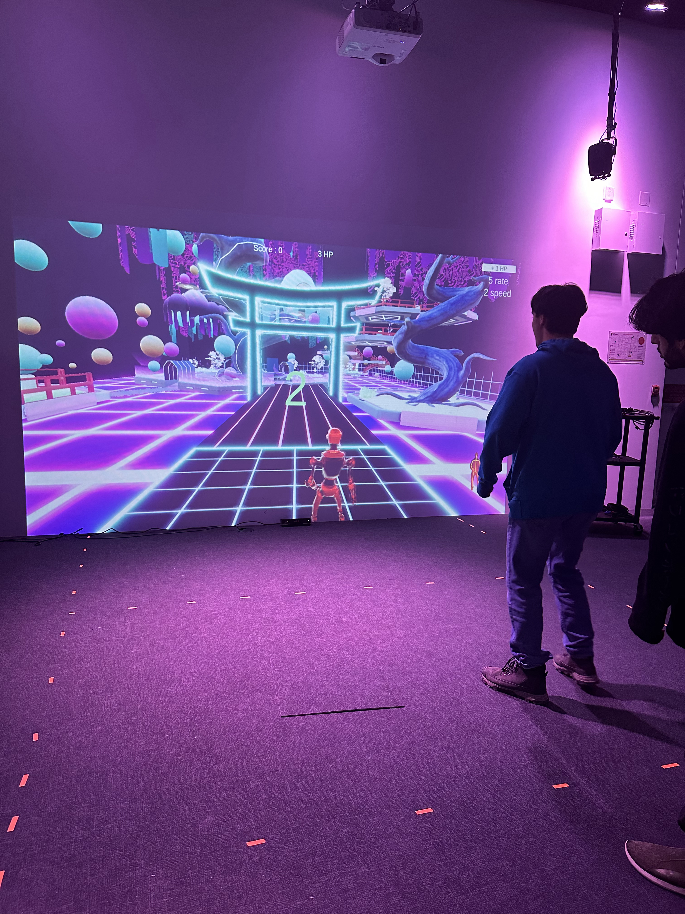
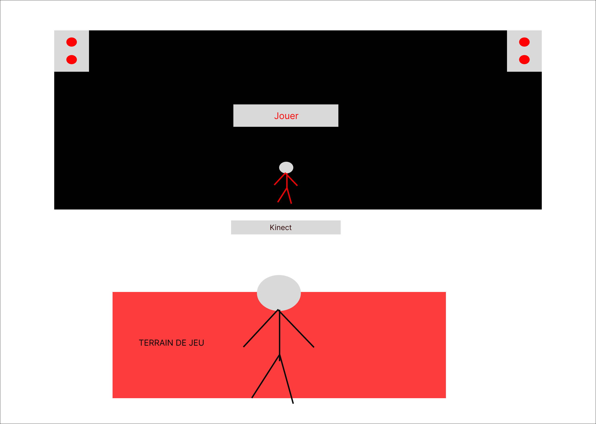
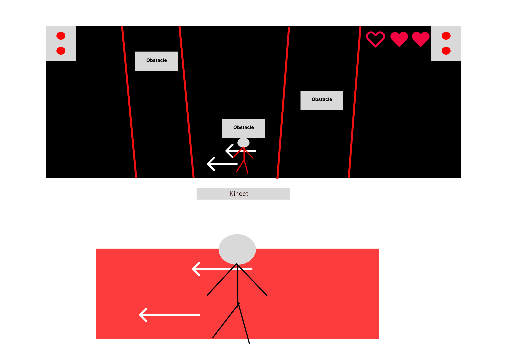
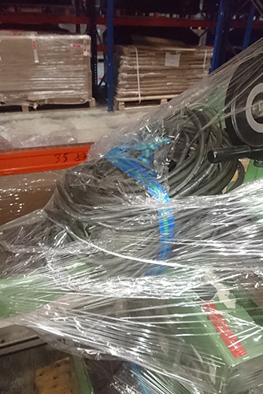
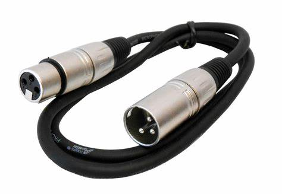
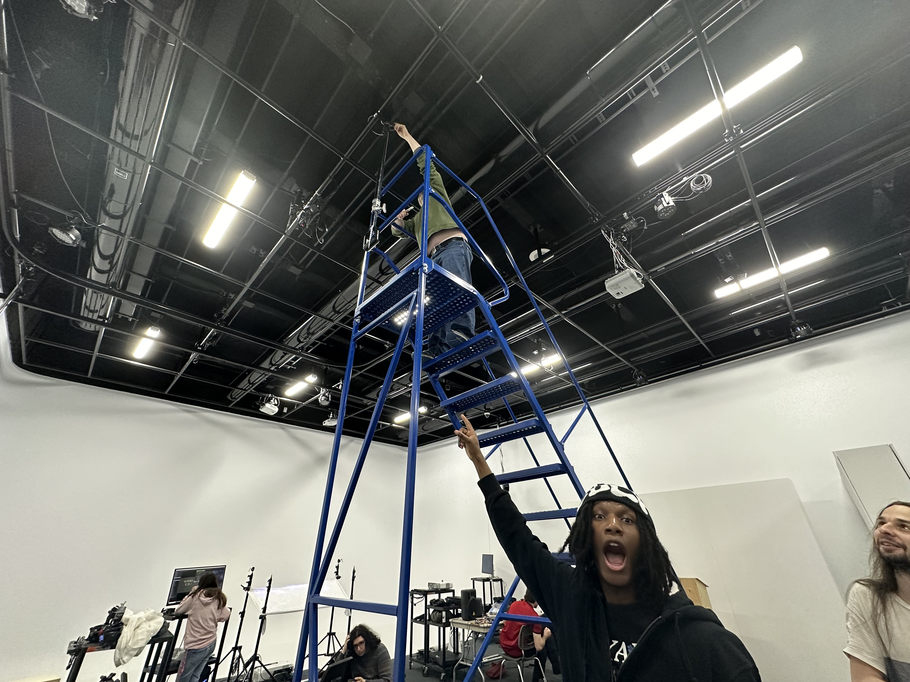
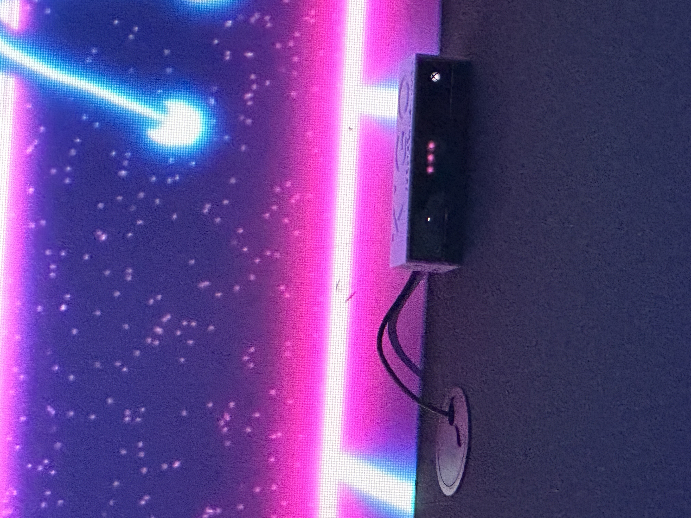
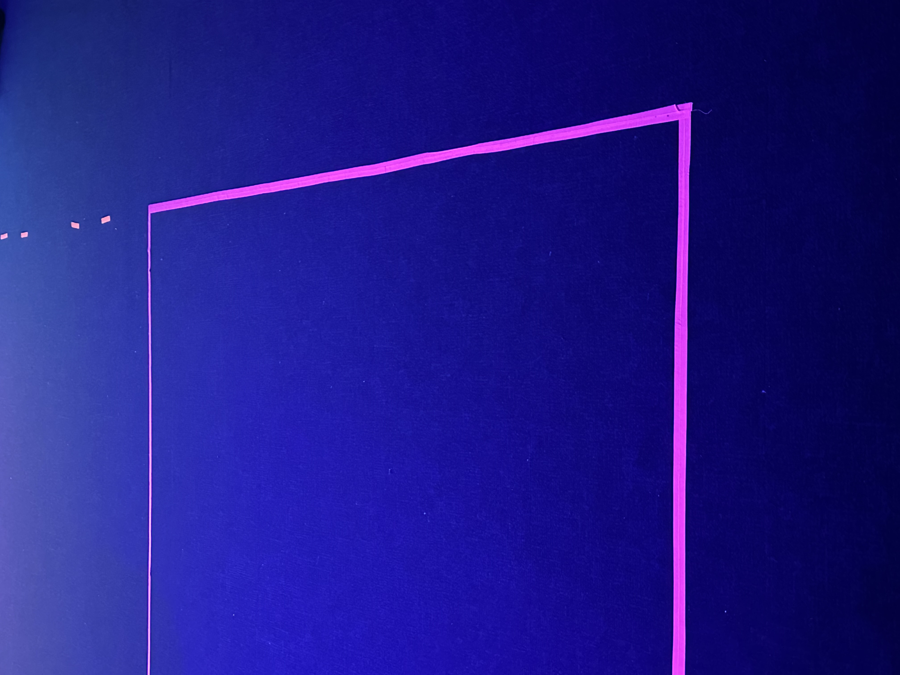

# Kigo
### Créateurs  : Érick Ouellette, William Rathier Mailly, Gabriel Clerval, Nicolas St-Martin et Antoine Dion

## Lien avec le thème Crescentia 
Le lien avec le thème Crescentia est que le projet offre une immersion visuelle et sonore qui renforce cette thématique.

## Nom de l'exposition
Le nom de l'exposition est Cresentia.

## Lieu de mise en exposition
Le lieu de mise en exposition est dans le grand studio du Collège Montmorency.

## Type d'exposition
Le type d'exposition se situe à l'intérieur d'une salle, plus précisément dans le grand studio.

## Date de la visite
La date de la première visite était le 28 février mars 2024 et la date de la deuxième visite était le 13 mars 2024. 

## Titre de l'oeuvre
Le titre de l'oeuvre est Kigo.

- ### Source: https://tim-montmorency.com/2024/projets/Kigo/docs/web/index.html
  
## Schéma de l'installation 

- ### Kigo plantation
 

- ### Source: https://tim-montmorency.com/2024/projets/Kigo/docs/web/preproduction.html

## Année de réalisation 
L'année de la réalisation est en 2024.

## Description de l'oeuvre
Kigo est un projet multimédia interactif où l’interacteur doit esquiver des obstacles virtuels qui se rapproche vers lui dans une thématique des quatre saisons de l’année. L’interacteur doit embarquer se déplacer dans une zone de jeu où une Kinect captera ses mouvements. L’avatar du jeu suivra les mouvements de l’interacteur. Les mouvements possibles sont d’aller de gauche à droite et l’accroupissement. L’esthétique du projet sera une projection d’un univers 3d de style néon rétro, qui ressemblera à une route où les obstacles s’avancent vers le joueur. Il y aura des arbres des deux côtés de la route et ceux-ci vont changer à chaque niveau puisque ces niveaux sont basés chacun sur une saison différente. Une musique synthwave jouera pour chaque niveau et sera accompagnée d’ambiances et des bruitages semblables à leur saisons. Le temps de cette expérience est démontré par le fait que chaque niveau se passe dans une différente saison, ce qui fait passer une année. Cette expérience a pour but d’amener de faire ressentir à l’interacteur, de l’engagement et de la détermination pour finir ces niveaux qui deviennent de plus en plus difficiles.

- ### Source: https://tim-montmorency.com/2024/projets/Kigo/docs/web/preproduction.html

## Type d'installation 
Le type d'installation est interactif.

- ### Source: https://tim-montmorency.com/2024/projets/Kigo/docs/web/index.html
  
- ### Voici le fonction du dispositif multimédia

## Fonction du dispositif multimédia
- ### Voici comment fonctionne le dispositif : la partie noire correspond à l'affichage du jeu du projet, tandis que la partie rouge représente le terrain de jeu.

- ### Source: https://tim-montmorency.com/2024/projets/Kigo/docs/web/preproduction.html
  
- ### Le déroulement du jeu
  

- ### Source: https://tim-montmorency.com/2024/projets/Kigo/docs/web/preproduction.html
  
## Mise en espace
Pour la configuration de l'espace, celle-ci se déroule sur un mur équipé d'un projecteur. La zone utilisée occupe la moitié verticale en face de l'écran du projet. Des haut-parleurs sont fixés à côté de la projection murale, un ordinateur et une console de jeu se trouvent à gauche de l'écran, et le Kinect V2 est placé au sol en face de l'écran.

- ### Kigo mise en place

- ### Source: https://tim-montmorency.com/2024/projets/Kigo/docs/web/preproduction.html
  
## Composantes et techniques
Les composantes et les techniques utilisées sont les haut-parleurs, le Kinect V2, la console de jeu, un projecteur, ainsi que des câbles et des fils électriques. En emballant soigneusement ces composantes, l'ensemble du dispositif pourra être transporté en toute sécurité outre-mer pour une exposition.

- ### Source: https://www.bing.com/images/search

## Éléments nécessaires à la mise en exposition
Pour exposer l'œuvre, un projecteur était suspendu au plafond à l'aide d'un support spécifique. Quatre câbles XLR (M->F) d'une longueur estimée entre 4 et 6 mètres étaient utilisés, ainsi qu'un câble d'alimentation pour l'ordinateur et la console de son. Deux câbles HDMI étaient également nécessaires, ainsi que plusieurs fils électriques pour alimenter l'ensemble du dispositif.

- ### Câbles XLR
  

- ### Source: https://www.bing.com/images/search
  
- Projecteur
  

- ### Source: https://tim-montmorency.com/2024/projets/Kigo/docs/web/preproduction.html
  
## Expérience vécue
Avant de commencer l'exploration, l'animateur a demandé qui voulait participer. Une fois qu'une personne se porte volontaire, elle doit se positionner entre les lignes délimitées et ne pas les dépasser pour pouvoir participer. Une fois le projet lancé, plusieurs obstacles apparaissaient à l'écran. Le participant devait les éviter et essayer d'accumuler le plus de points possible en évitant ces obstacles.

## ❤️ Ce qui vous a plu, vous a donné des idées
Ce qui m'a plu, c'était la créativité du projet. J'ai aimé le fait qu'il fallait bouger pour participer et atteindre le score le plus élevé, et regarder les autres participants était également intéressant. Une fois que j'ai su qu'ils avaient utilisé le matériel Kinect V2, cela m'a fait réfléchir au genre de projet que je pourrais réaliser. C'était très intéressant.

- Photo du Kinect V2
 

- ### Source: Ma photo
  
## 🤔 Aspect que vous ne souhaiteriez pas retenir pour vos propres créations ou que vous feriez autrement
L'aspect que je ne souhaiterais pas retenir est le manque d'espace qu'ils ont utilisé, même si ce projet n'était pas le seul dans le grand studio. J'aurais aimé qu'il y ait plus d'espace pour se déplacer et permettre aux spectateurs de regarder confortablement, sans être dérangés par d'autres personnes qui passent devant nous pendant l'exposition.

- ### Photo du sol qui montre l'espace
  

- ### Source: Ma photo
  
## Avant l'expérimentation
En participant à ce projet, j'éprouve du plaisir et de l'excitation, car cela demande également de l'action, et j'aime bouger pour éviter les obstacles et atteindre les différents univers visuels avec des esthétiques différentes aux quatre saisons. L'adrénaline va monter.

## Après l'expérimentation
Après l'expérimentation, c'était le premier projet qui m'a le plus attiré et que j'ai le plus apprécié. J'ai beaucoup aimé le fait qu'il nécessite du mouvement et qu'il vise à atteindre le score le plus élevé possible. Ce projet m'a également inspiré pour envisager de réaliser un projet similaire si nécessaire.

