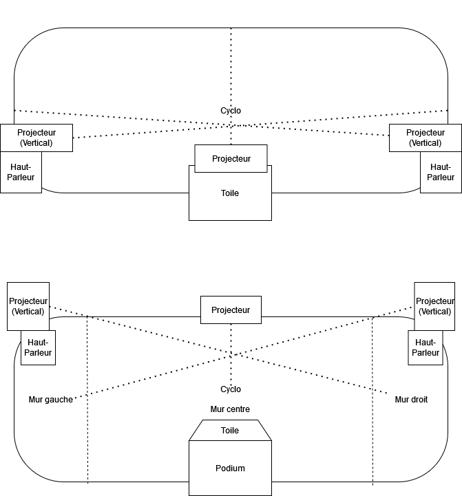

# 1. Rhizomatique
### Créateurs : Jolyanne Desjardins, MaÏka Désy, Laurie Houde et Felix Testa Radovanovic

## Lien avec le thème Crescentia 

https://tim-montmorency.com/2024/projets/Rhizomatique/docs/web/index.html

## Intallation en cours dans le studio

- #### Voici l'intallation en cours du projet

 
- #### Source: Ma photo

## Schéma de l'installation 

#### - Rhizomatique plantation
 

Source: https://tim-montmorency.com/2024/projets/Rhizomatique/docs/web/preproduction.html

## Appréciation
Pour ce projet, je crois ressentir une curiosité à découvrir les souvenirs cachés. Les images projetées pourront me faire penser à ma propre vie et à mes propres expériences. Cette expérience pourrait me faire sentir connecté aux autres personnes qui partagent cette exploration et que le temps est important dans nos vies

# 3. Effet-Papillon
### Créateurs  : Raphaël Dumont, Alexis Bolduc, William Morel, Alexia (Ryan) Papanikolaou, Viktor Zhuralev et Jasmine Lapierre

## Lien avec le thème Crescentia 
Source: https://tim-montmorency.com/2024/projets/Effet-Papillon/docs/web/index.html

## Intallation en cours dans le studio
- Voici l'intallation en cours du projet

 
- #### Source: Ma photo
## Schéma de l'installation 
#### - Effet-Papillon plantation
 

Source: https://tim-montmorency.com/2024/projets/Effet-Papillon/docs/web/preproduction.html

## Appréciation
Pour ce projet, je ressens un sentiment de connexion avec la nature et d'apprendre davantage sur les processus de croissance des plantes. Une fois que je vais decouvrir les conséquences de mes actions sur la pomme finale, cela pourrais me faire réfléchir à l'impact de mes choix sur l'environnement.

# 4. Sonalux
### Créateurs : Antoine Haddad, Camélie Laprise, Ghita Alaoui et Vincent Desjardins

## Lien avec le thème Crescentia 
Source: https://tim-montmorency.com/2024/projets/Sonalux/docs/web/index.html

## Intallation en cours dans le studio
#### - Voici l'intallation en cours du projet 

Source: Ma photo
## Schéma de l'installation 
#### - Sonalux plantation
 

Source: https://tim-montmorency.com/2024/projets/Sonalux/docs/web/preproduction.html

## Appréciation
En explorant les instruments du projet et en créant ma propre musique, je peux ressentir une connexion et du plaisir tout en trouvant du bonheur dans la créativité.

 # 5. Canevas Cosmique
### Créateurs  : Jacob Alarie-Brousseau, Étienne Charron, Jérémy Cholette, Quoc Huy Do et Mikaël Tourangeau

## Lien avec le thème Crescentia 
Source: https://tim-montmorency.com/2024/projets/Canevas-Cosmique/docs/web/index.html

## Intallation en cours dans le studio
#### - Voici l'intallation en cours du projet 

Source: Ma photo
## Schéma de l'installation 
#### - Canevas Cosmique plantation
 

Source: https://tim-montmorency.com/2024/projets/Canevas-Cosmique/docs/web/preproduction.html

## Appréciation
Pour ce projet, je ressens de la curiosité et un peu de nervosité en explorant la simulation du système solaire, puisque je vais être seul dans le laboratoire.

# 6. 3 cours du programme incoutournables
# 7. 
# 8. Le projet préféré
ordonner les projets selon votre préférence actuelle (1 = votre projet préféré), avec justification (avant/après l'expérimentation)
