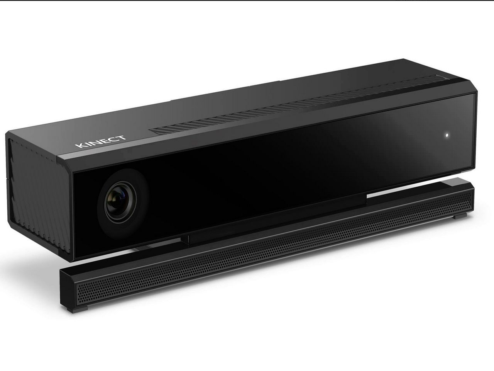

# 1. Rhizomatique
### Créateurs : Jolyanne Desjardins, MaÏka Désy, Laurie Houde et Felix Testa Radovanovic

## Lien avec le thème Crescentia 
Le lien avec le thème Crescentia réside dans le fait que le projet Rhizomatique explore la croissance et l'évolution des souvenirs à travers l'interaction humaine, représentant ainsi le thème de Crescentia par sa mise en avant de la transformation constante dans le temps et la mémoire.

## Intallation en cours dans le studio

- ### Voici l'intallation en cours du projet

 
- ### Source: Ma photo

## Schéma de l'installation 

- ###  Rhizomatique plantation
 

- ### Source: https://tim-montmorency.com/2024/projets/Rhizomatique/docs/web/preproduction.html

## Avant l'expérimentation
Pour ce projet, je crois ressentir une curiosité à découvrir les souvenirs cachés. Les images projetées pourront me faire penser à ma propre vie et à mes propres expériences. Cette expérience pourrait me faire sentir connecté aux autres personnes qui partagent cette exploration et que le temps est important dans nos vies.

## Après l'expérimentation
Après avoir participé au projet, j'ai beaucoup apprécié, particulièrement lorsqu'il a fallu intervenir sur la toile interactive sous différents angles. Cela m'a ramené à mon enfance, à ma vie et aux personnes qui m'entourent. En résumé, j'ai beaucoup aimé cette expérience d'exploration.

# 2. Effet-Papillon
### Créateurs  : Raphaël Dumont, Alexis Bolduc, William Morel, Alexia (Ryan) Papanikolaou, Viktor Zhuralev et Jasmine Lapierre

## Lien avec le thème Crescentia 
Le lien est qu'il explore les répercussions de nos actions sur un système complexe, illustrant ainsi le thème Crescentia de l'interconnectivité.

## Intallation en cours dans le studio
- ### Voici l'intallation en cours du projet

 
- ### Source: Ma photo
## Schéma de l'installation 
- ### Effet-Papillon plantation
 

- ### Source: https://tim-montmorency.com/2024/projets/Effet-Papillon/docs/web/preproduction.html

## Avant l'expérimentation
Pour ce projet, je ressens un sentiment de connexion avec la nature et d'apprendre davantage sur les processus de croissance des plantes. Une fois que je vais decouvrir les conséquences de mes actions sur la pomme finale, cela pourrais me faire réfléchir à l'impact de mes choix sur l'environnement.

## Après l'expérimentation
Après l'expérimentation, j'ai surtout apprécié les efforts que les étudiants ont déployés, car c'était un projet que j'ai trouvé très difficile par rapport aux autres, selon moi. J'ai aimé la conclusion, une fois que l'action a été choisie. Cela m'a fait réfléchir à mes choix concernant l'environnement.

# 3. Canevas Cosmique
### Créateurs  : Jacob Alarie-Brousseau, Étienne Charron, Jérémy Cholette, Quoc Huy Do et Mikaël Tourangeau

## Lien avec le thème Crescentia 
Un laboratoire où une simulation de système solaire vous invite à interagir en contrôlant des statues.

## Intallation en cours dans le studio

- ### Voici l'intallation en cours du projet 

- ### Source: Ma photo

## Schéma de l'installation 
- ### Canevas Cosmique plantation
 

- ### Source: https://tim-montmorency.com/2024/projets/Canevas-Cosmique/docs/web/preproduction.html

## Avant l'expérimentation
Pour ce projet, je ressens de la curiosité et un peu de nervosité en explorant la simulation du système solaire, puisque je vais être seul dans le laboratoire.

## Après l'expérimentation
À la fin du projet, j'ai apprécié la créativité des étudiants. J'ai aimé la fabrication des planètes grâce à une imprimante 3D. J'ai trouvé cette créativité géniale.

# 4. Sonalux
### Créateurs : Antoine Haddad, Camélie Laprise, Ghita Alaoui et Vincent Desjardins

## Lien avec le thème Crescentia 
Le lien est que le projet Sonalux offre une expérience d'art génératif où le temps est changé.

## Intallation en cours dans le studio
- ### Voici l'intallation en cours du projet 

- ### Source: Ma photo
  
## Schéma de l'installation
- ### Sonalux plantation
 

- ### Source: https://tim-montmorency.com/2024/projets/Sonalux/docs/web/preproduction.html

## Avant l'expérimentation
En explorant les instruments du projet et en créant ma propre musique, je peux ressentir une connexion et du plaisir tout en trouvant du bonheur dans la créativité.

## Après l'expérimentation
Une fois le projet terminé, je n'ai pas vraiment aimé l'expérience. En raison de mon handicap auditif, il m'était difficile de porter des écouteurs et d'écouter les sons tout en participant à des activités créatives en même temps.

 ## Cours requis
Les trois cours requis du programme de la technique d'intégration multimédia pour ce genre de projet sont tous les cours de Web, le cours d'interactivité ludique et le cours de Modélisation 3D. J'ai choisi le cours de Web, car c'est un cours où l'on apprend à programmer pour faire bouger ou manipuler des contenus. Par exemple, dans le projet Kigo, ils ont dû faire de la programmation pour faire bouger le personnage face à plusieurs obstacles. Ensuite, j'ai pris le cours d'interactivité ludique, un cours où l'élève conçoit et réalise un projet ludique sur ordinateur en intégrant des images et des échantillons sonores. Son objectif est de créer une expérience interactive et divertissante où l'utilisateur progresse selon ses actions. Puis, le cours de Modélisation 3D où l'on concevra des objets en trois dimensions. 

- ### Source: https://www.cmontmorency.qc.ca/programmes/nos-programmes-detudes/techniques/techniques-dintegration-multimedia/grille-de-cours/
  
## Composante technologique
La composante technologique que je ne connais pas est le Kinect v2, utiliser dans plusieurs projets comme le projet Kigo et Canevas Cosmique. C'est une composante technologique qui capte des mouvements pour la Xbox One. Il utilise des caméras, des capteurs de profondeur et des microphones pour permettre aux utilisateurs d'interagir avec les jeux sans une manette.

- ### Voici la composante technologique 
 

- ### Source: https://www.windowscentral.com/kinect-windows-v2-gets-updated-sdk-kinect-fusion-tool-kit

