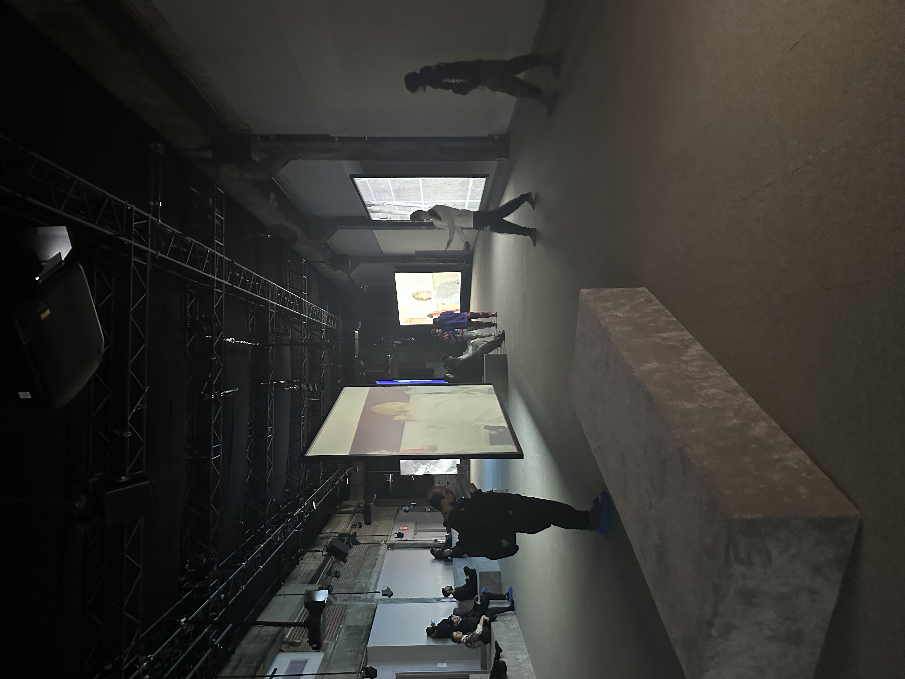

# Mon avis sur l'experience

## Nom de l'exposition
Le nom de l'exposition est Phase Shifting Index. 

## Lieu de mise en exposition
Le lieu de mise en exposition est a la fonderie Darling. 

## Type d'exposition
Le type d'exposition est dans une salle qui n'est pas petit et qui n'est pas grand aussi, avec des projecteurs et des ecrans. 
 widht:100 height:100

## Date de la visite
La date de la visite etait le 31 janvier 2024. 

## Titre de l'oeuvre

## Nom de l'artiste
Le nom de l'artiste est Jeremy Shaw.

## Anne de realisation 
L'anne de la realisation est en 2020.

