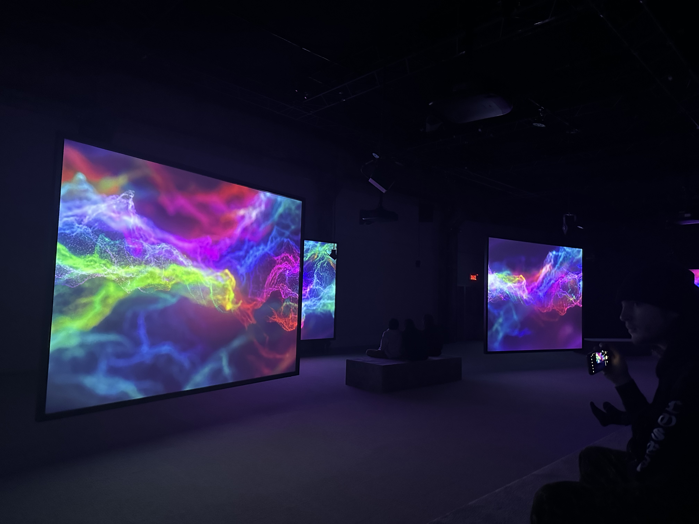
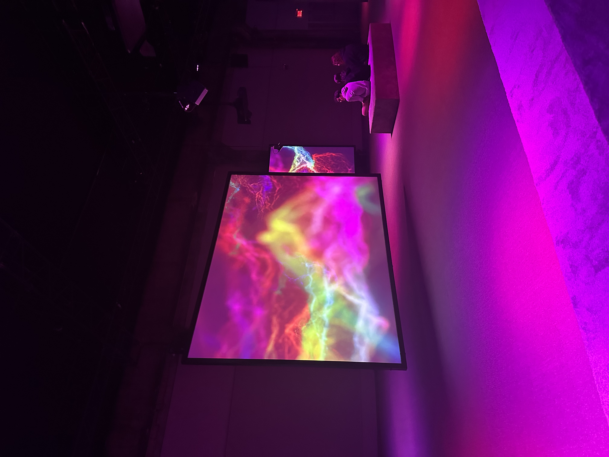
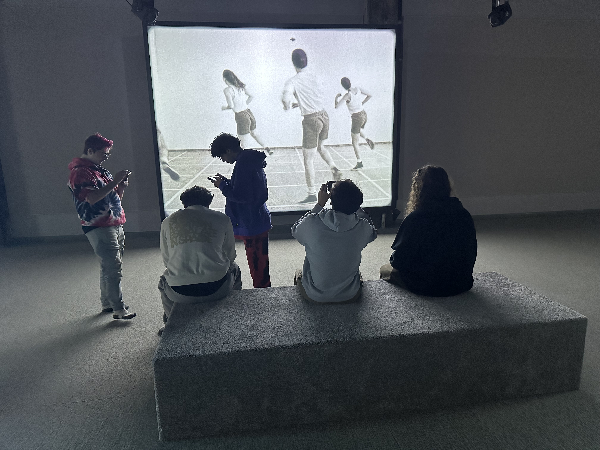

# Mon avis sur l'expérience

## Nom de l'exposition
Le nom de l'exposition est Phase Shifting Index. 

## Lieu de mise en exposition
Le lieu de mise en exposition est à la fonderie Darling. 

## Type d'exposition
Le type d'exposition est dans une salle qui n'est pas petit et qui n'est pas grand aussi avec des projecteurs et des écrans. 

 

## Date de la visite
La date de la visite était le 31 janvier 2024. 

## Titre de l'oeuvre
Le titre de l'euvre est Jeremy Shaw : Phase Shifting Index. 

source: https://macm.org/expositions/jeremy-shaw/
## Nom de l'artiste
Le nom de l'artiste est Jeremy Shaw.

source: https://macm.org/expositions/jeremy-shaw/
## Année de réalisation 
L'année de la réalisation est en 2020.

source: https://macm.org/expositions/jeremy-shaw/
## Description de l'oeuvre
L'installation vidéo de sept canaux avec des projecteurs, les sept écrans affichent des images d’archives de divers groupes de thérapie par le mouvement des années 60 aux années 90. Ces images sont prises dans les formats de l’époque, ce qui veut dire du film 16 mm au VHS en passant par le Hi-8.

source: https://macm.org/expositions/jeremy-shaw/
## Type d'installation 
Le type d'installation est immersif, car c'est un concept technologique qui s’appuie sur différents types de supports et de technologies pour plonger un groupe de personnes autre que leur réalité actuelle.

## Mise en espace
Pour la mise en espace, il y a trois écrans en arrière et quatre écrans devant. Le numéro quatre de l'écran est accroché sur le mur blanc. Les restes des canaux ne sont pas accrochés sur le mur, mais on peut voir l'arrière de ces écrans. Lors de l'exploration, il y avait suffisamment d'espace pour circuler et regarder la pièce en même temps.

 

## Composantes et techniques
Pour la diffusion, des personnages ont été utilisés pour faire des chorégraphies et des évocations de pratiques spirituelles. Des projecteurs de couleurs ont été utilisés durant l'exposition pour mettre de l'ambiance et le rendre intéressant à regarder. Des sons pour chaque écran et vers la fin, une fois que le son devient fort, je croyais qu’il y avait seulement un son pour tous les canaux.   

## Éléments nécessaires à la mise en exposition
L'exposition a cinq bancs et un banc en forme d'escalier pour admirer tous les écrans. Chaque écran contient un projecteur et des cache-fils reliés vers le plafond. Puis, le sol est fait en tapis et les écrans peuvent être vus de l'arrière.

 

source image: https://macm.org/expositions/jeremy-shaw/

## Expérience vécue
Avant de faire l'exploration, il fallait enlever nos chaussures ou mettre une protection pour les chaussures. Notre responsable nous a expliqué comment l'exposition fonctionnera. Il nous a également donné un cahier avec des textes pour pouvoir mieux comprendre l'exposition. Une fois arrivée, j'observe la scène et j'essaye de comprendre. Au début, l'ambiance devient calme, vers le milieu et la fin l'ambiance devient de plus en plus excitante. Le son devient de plus en plus fort aussi. Vers la fin, l'ambiance devient incroyable avec le son qui devient intense, j'avais la pression que j'étais dans une boite de nuit. Soudain, tout se ferme et reste silencieux. J'ai adoré l'ambiance, malgré le fait que je n'ai pas vraiment compris le sujet.

## ❤️ Ce qui vous a plu, vous a donné des idées
Ce qui m'a plu durant l'exposition était qu'il y avait des bancs devant les écrans pour s'asseoir. J'ai trouvé cela très agréable et très confortable. J'ai aussi aimé les sons et surtout l'ambiance qui me mettait à l'aise pendant l'exposition. 

## 🤔 Aspect que vous ne souhaiteriez pas retenir pour vos propres créations ou que vous feriez autrement
Les aspects que je ne souhaiterais pas retenir étaient le sujet de l'exposition. J'aurai aimé que le sujet soit facile et clair à comprendre. Pendant l'exposition, je n'ai pas vraiment compris le sujet et le but de ce projet, même-ci il y avait les textes pour nous aider a comprendre. Il y avait trop d'action qui se passait, je préfère qu'on mette les choses une à la fois. J'aurai aimé un sujet clair et net à propos dans laquelle on vit actuellement, pour nous aider à comprendre. 

