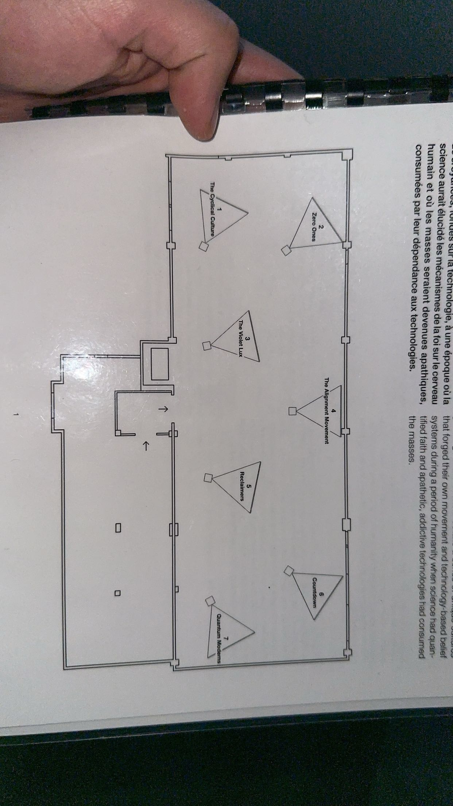
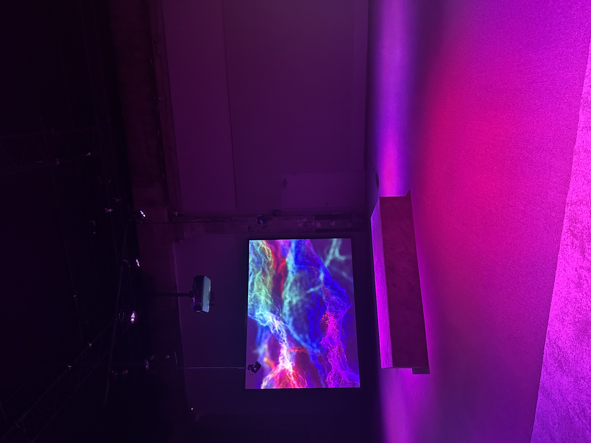
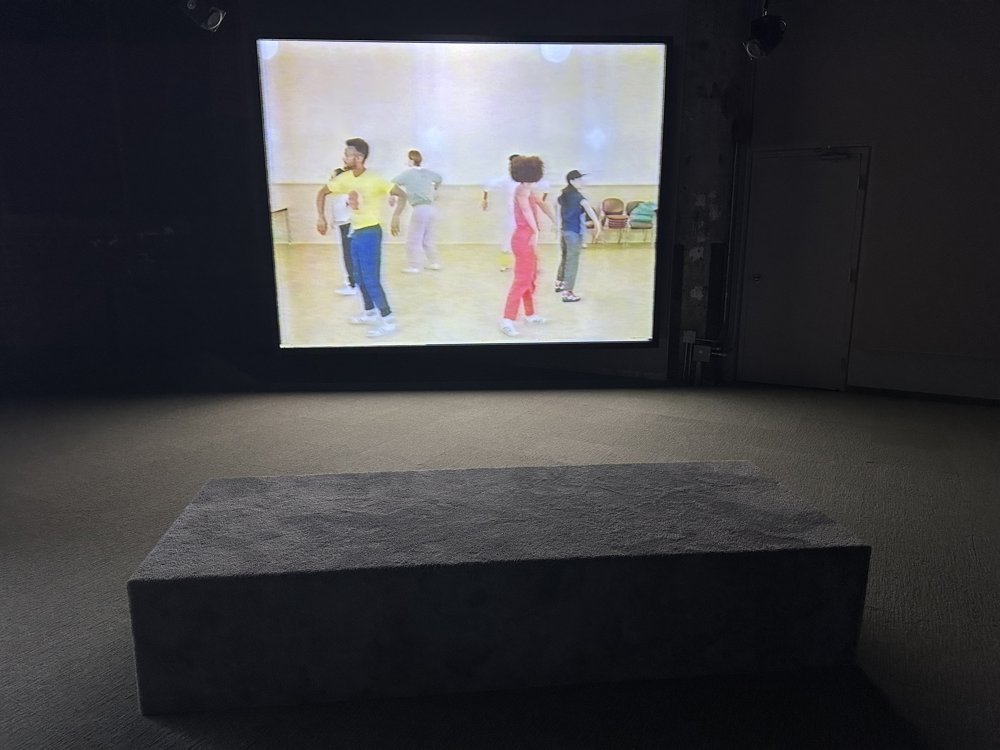
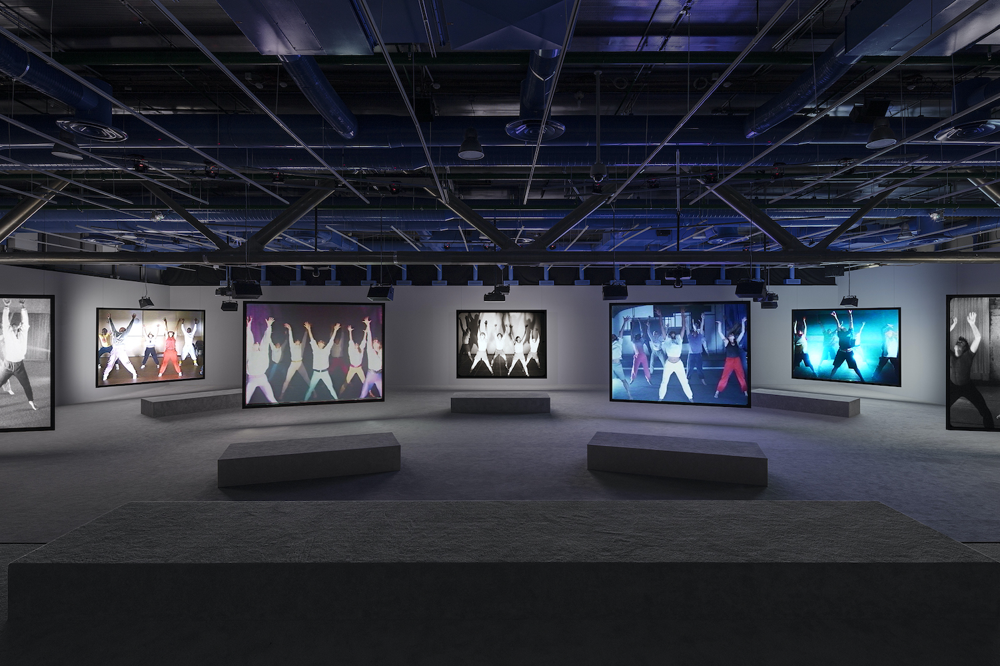

# Mon avis sur l'experience

## Nom de l'exposition
Le nom de l'exposition est Phase Shifting Index. 

## Lieu de mise en exposition
Le lieu de mise en exposition est a la fonderie Darling. 

## Type d'exposition
Le type d'exposition est dans une salle qui n'est pas petit et qui n'est pas grand aussi, avec des projecteurs et des ecrans. 

 

## Date de la visite
La date de la visite etait le 31 janvier 2024. 

## Titre de l'oeuvre
Le titre de l'euvre est Jeremy Shaw : Phase Shifting Index. 

source: https://macm.org/expositions/jeremy-shaw/
## Nom de l'artiste
Le nom de l'artiste est Jeremy Shaw.

source: https://macm.org/expositions/jeremy-shaw/
## Anne de realisation 
L'anne de la realisation est en 2020.

source: https://macm.org/expositions/jeremy-shaw/
## Description de l'oeuvre
L'installation vidéo de sept canaux avec des projecteurs, les sept écrans affichent des images d’archives de divers groupes de thérapie par le mouvement des années 60 aux années 90. Ces images sont pris dans les formats de l’époque, ce qui veut dire du film 16 mm au VHS en passant par le Hi-8. 

source: https://macm.org/expositions/jeremy-shaw/
## Type d'installation 
Le type d'installation est immersive, car c'est un concept technologique qui s’appuie sur différents types de supports et de technologies pour plonger un groupe de personnes autre que leur réalité actuelle.

## Mise en espace
Pour la mise en espace, il y a trois ecrans en arriere et quatre ecrans devant. L'ecran 4 est accroche sur le mur blanc. Les reste des canaux ne sont pas accroches sur le mur, mais on peut voir l'arriere de ces ecrans. Lors de l'exploration, il y avait suffisament d'espace pour circuler et regarder la piece en meme temps.

 

## Composantes et techniques
Pour la diffusion, des personnages ont ete utilise pour faire des chorégraphies et des évocations de pratiques spirituelles. Des projecteurs de couleurs ont ete utilise vers la fin de l'exposition.

## Éléments nécessaires à la mise en exposition
L'exposition a cinq bancs et un banc en forme d'escalier pour admirer tous les ecrans. Chaque ecran contient un projecteur et des caches-fils relies vers le plafond. Puis, le sol est fait en tapis et les ecrans peuvent etre vu de l'arriere.

## Expérience vécue
D'apres mon experience, 

## ❤️ Ce qui vous a plu, vous a donné des idées
Ce qui m'a plu durant l'exposition etait qu'il y avait des bancs devant les ecrans pour s'assoeir. J'ai trouve cela tres agreable et tres confortable. J'ai aussi aime les sons et surtout l'ambience qui me mettait a l'aise pendant l'exposition. 

## 🤔 Aspect que vous ne souhaiteriez pas retenir pour vos propres créations ou que vous feriez autrement
Les aspects que je ne souhaiterais pas retenir etait le sujet de l'exposition. J'aurai aime que le sujet soit facile et claire a comprendre. Pendant l'exposition, je n'ai pas vraiment compris le sujet et le but de ce projet, meme-ci il y avait les textes pour nous aider a comprendre. Il y avait trop d'action qui se passait, je prefere qu'on met les choses une a la fois. J'aurai aime un sujet clair et net a propos dans laquelle on vit actuellement, pour nous aider a comprendre. 

