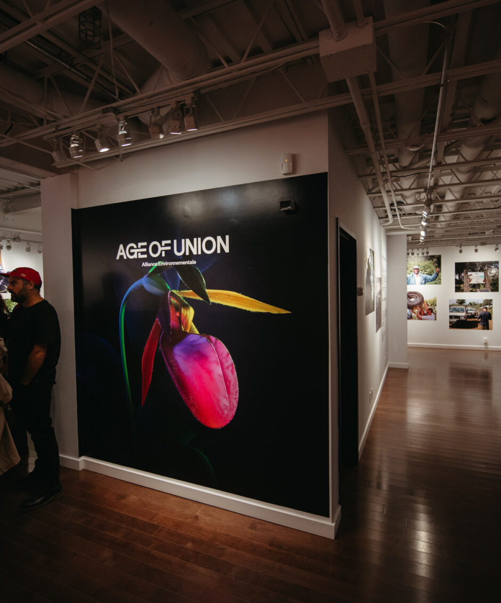
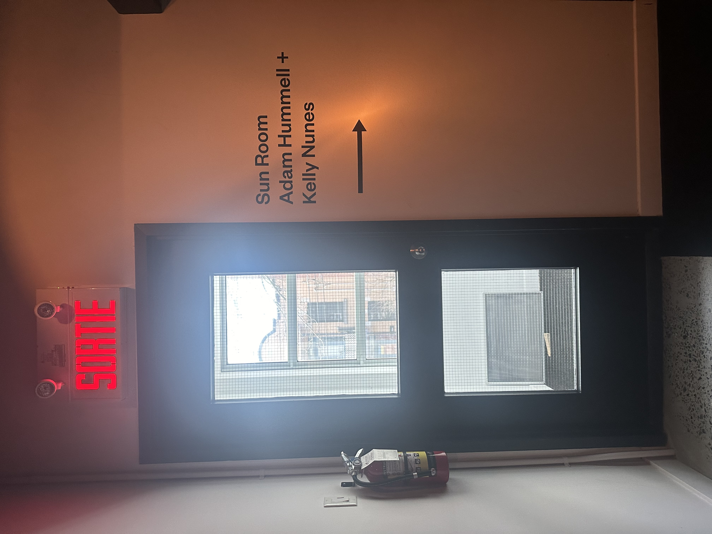
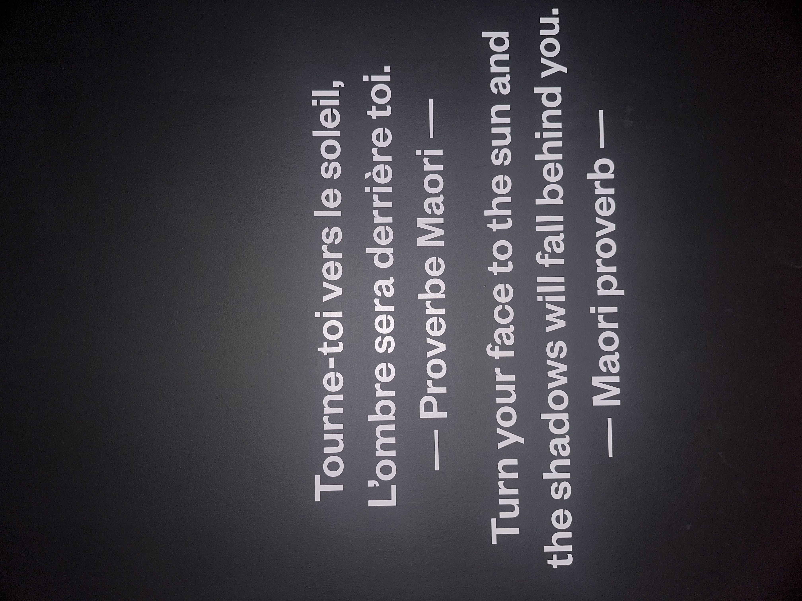
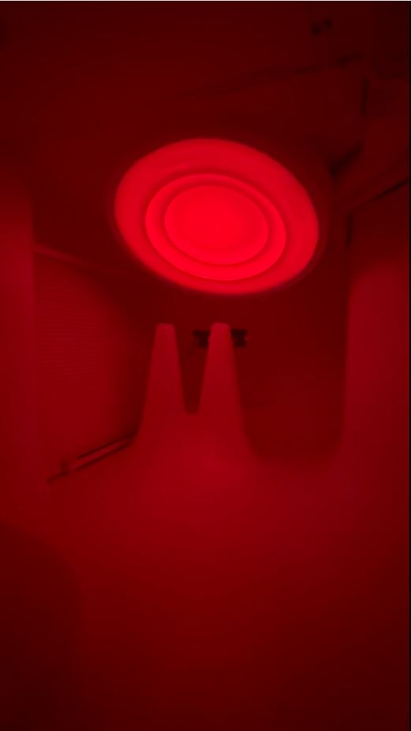
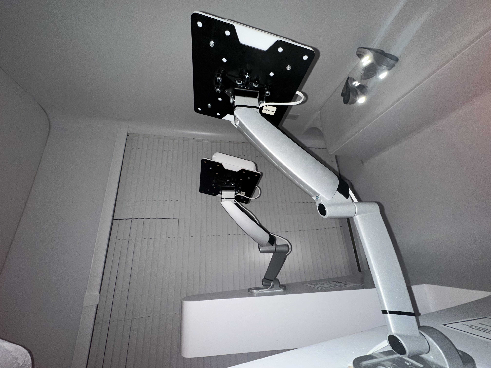
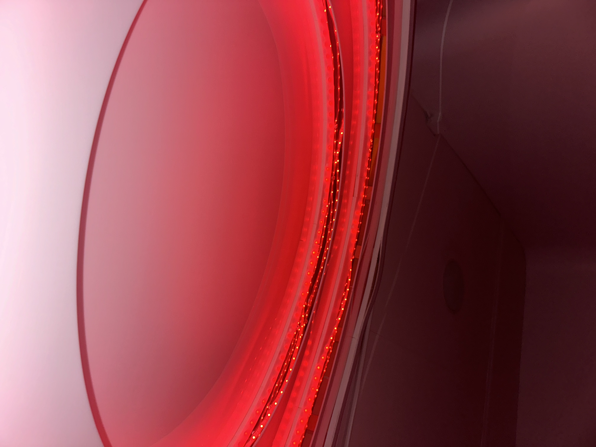
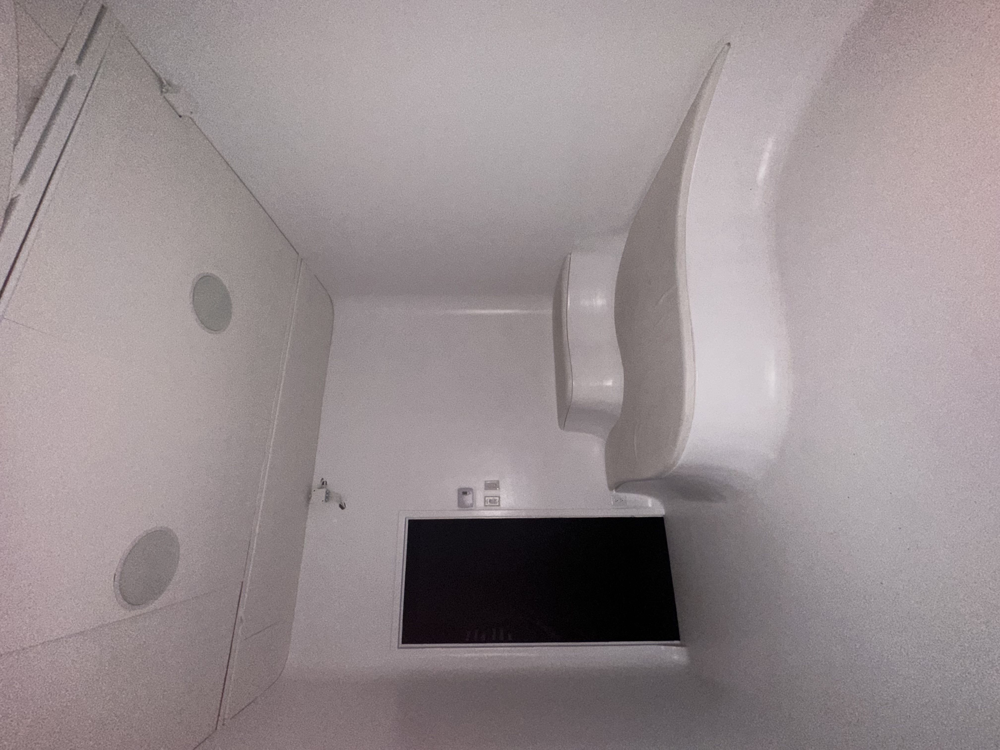
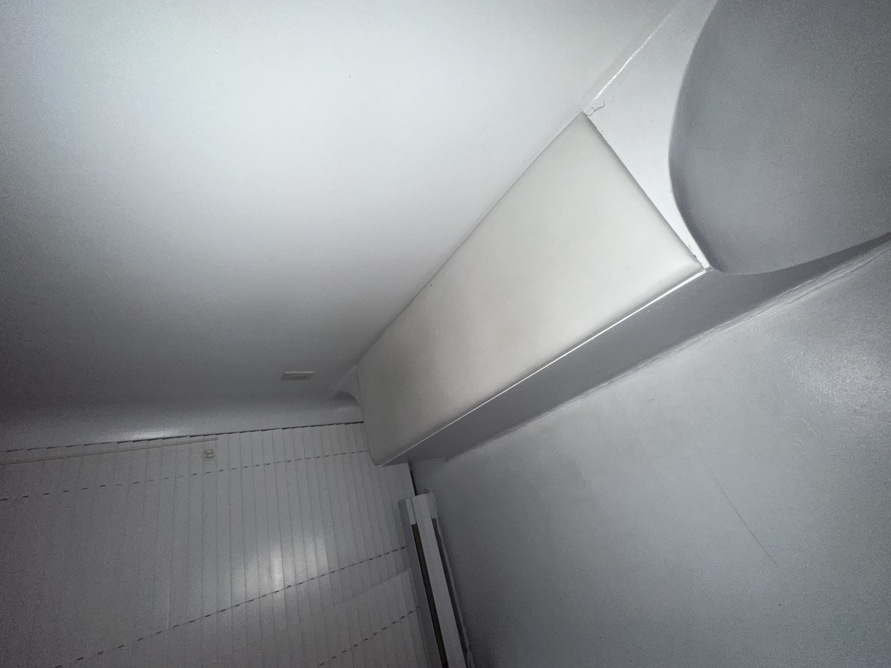
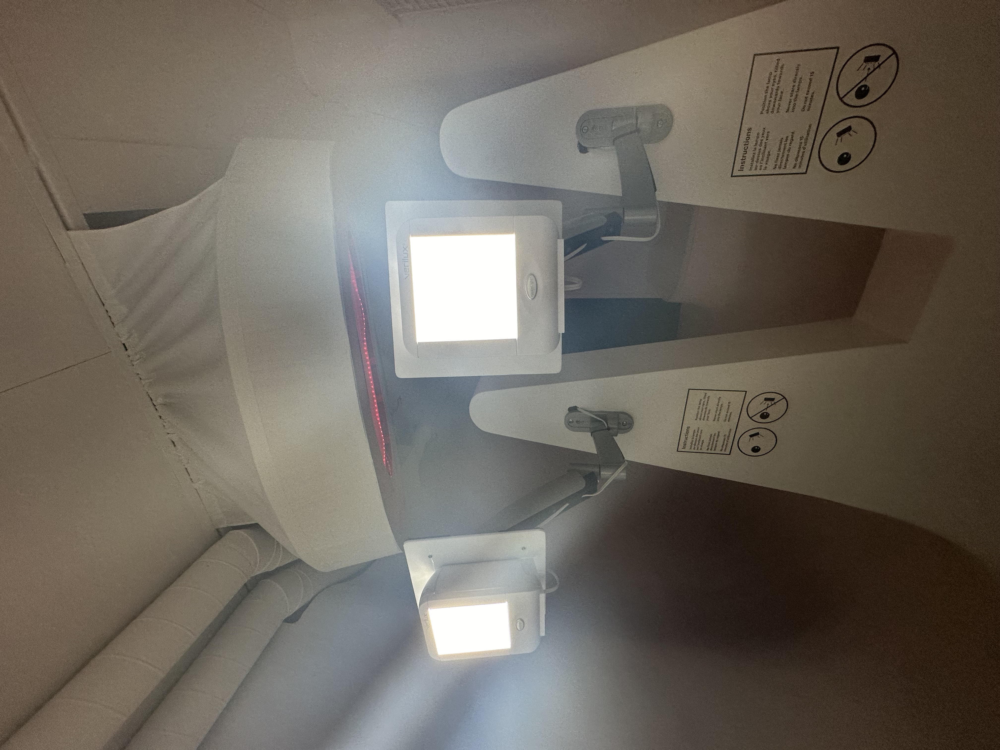
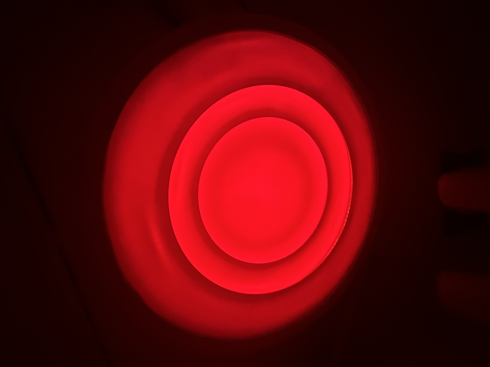

# Sun Room

## Nom de l'exposition
Le nom de l'exposition est Age of Union.

## Lieu de mise en exposition
Le lieu de mise en exposition est au Centre Age of Union

## Type d'exposition
Le type d'exposition est à l'intérieur. 

## Date de la visite
La date de la visite etait le 2 mars 2024.

## Titre de l'oeuvre
Le titre de l'oeuvre est Sun Room.

- ### Source: Ma photo
  
## Nom de l'artiste
Les noms de l'artiste sony Adam Hummell et Kelly Nunes. 

## Année de réalisation 
L'année de la réalisation est en 2021. 

## Description de l'oeuvre
"Tourne-toi vers le soleil, l'ombre sera derrière toi. -Proverbe Maorie- "

- ### Consigne
  

- ### Source: Ma photo

## Type d'installation 
Le type d'installation est immersif. 

- ### Installation
  

- ### Source: Ma photo

## Fonction du dispositif multimédia
- ### Voici le fonction du dispositif multimédia
  

- ### Source: Ma photo
  
## Mise en espace
Pour la mise en espace, à l'entrée, il y a un banc et un projecteur accroché au plafond. Ensuite, il y a deux petits écrans, chacun avec un support pour se tenir et un banc pour s'asseoir en face de l'écran. L'espace occupé est dans une petite pièce, d'une taille approximativement équivalente à la moitié du petit studio du Collège Montmorency. 

## Composantes et techniques
Les composantes et les techniques utilisées lors du projet comprennent une longue lumière à LED de couleur orange très foncé de plusieurs mètres, des câbles électriques pour les deux petits écrans et les lumières, ainsi que des supports pour maintenir les écrans.

- ### Supports écrans

- ### Source: Ma photo

- ### Lumière à LED
  

- ### Source: Ma photo
  
## Éléments nécessaires à la mise en exposition
Les éléments intéressants sont les deux bancs, l'un à gauche de l'entrée et l'autre derrière les deux petits écrans, ainsi que les câbles électriques.

- ### Premier banc
 

- ### Source: Ma photo

- ### Deuxième Banc
  

- ### Source: Ma photo
  
## Expérience vécue
Une fois arrivée à l'exploration, une jeune femme assise devant une table m'a accueilli et m'a expliqué le fonctionnement de l'exposition. Ensuite, je suis monté à l'étage pour visiter l'œuvre. En entrant, j'ai retiré mes chaussures comme indiqué dans les consignes. À l'intérieur, j'ai remarqué une grosse boule accrochée au plafond, et j'ai immédiatement compris que cela représentait le soleil, en lien avec le titre de l'œuvre "Sun Room". Par la suite, je me suis assis devant l'un des petits écrans et j'ai cliqué sur un bouton pour qu'il s'ouvre. 

- ### Écrans
 

- ### Source: Ma photo

 ## ❤️ Ce qui vous a plu, vous a donné des idées
Ce qui m'a plus durant l'exposition, c'était la couleur de la lumière qui représentait le soleil. C'était agréable à voir et l'ambiance était calme, il n'y avait pas beaucoup de choses autour. J'ai beaucoup aimé cette atmosphère. Cependant, le projet ne m'a pas vraiment donné des idées.

- ### Projecteur
  

- ### Source: Ma photo
  
## 🤔 Aspect que vous ne souhaiteriez pas retenir pour vos propres créations ou que vous feriez autrement
Les aspects que je ne souhaite pas retenir sont que je n'ai pas vraiment compris le projet, car il manquait d'informations lors de l'exposition. De plus, le Centre Age of Union n'a pas non plus fourni d'informations sur cette œuvre sur leur site. J'aimerais en savoir plus sur cette œuvre, afin d'avoir au moins une idée de quoi il s'agit avant d'arriver sur place. Lorsque je me suis senti perdu, j'ai cherché de l'aide, mais il n'y en avait pas disponible directement. Il fallait se rendre à l'entrée principale pour demander de l'aide. En somme, je suggérerais de fournir davantage d'informations sur les œuvres, tant lors des expositions que sur les sites web correspondants.

