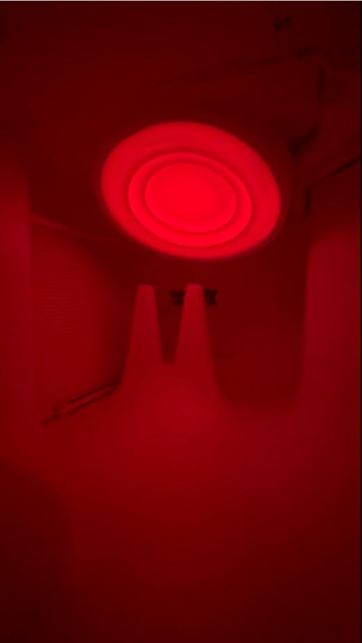

# Introduction 
Objectif: Présentation de "Sun Room" 

Expérience: Beaucoup aimé, ambience

Aspects: Les informations sur l'oeuvre et son fonctionnement.

Source: https://www.bing.com/images/search

 
Source: Ma photo

Source: Ma photo

# Développement 
Age of Union, Sun Room
    
Type Exposition: Interactif

 
 
Visite: 2 mars 2024, journée gratuite
    
Lumière orange: Soleil

    
Type Installation: Intérieur
 
Information: Lumière Led orange, petits écrans visible, deux bancs, câbles électriques.

    
Expérience vécue: Pas vraiment aimé, pas d'aide, peu de consigne, peu d'information, compliquer à  comprendre.

    
Appréciation: Ambience aimé, lumière agréable à regarder, plus de consignes
    
Faire: Mettre plus d'informations dans le site (Age of Union) 

 # Conclusion 
 Rappel des aspects: Plus d'informations, avoir de l'aide, pas vraiment aimé
 
 Ouverture: Me fait rappeler à l'oeuvre de Canevas Cosmique dans l'exposition de Cresentia
 
 Lien: Soleil avec des planètes. 

 
