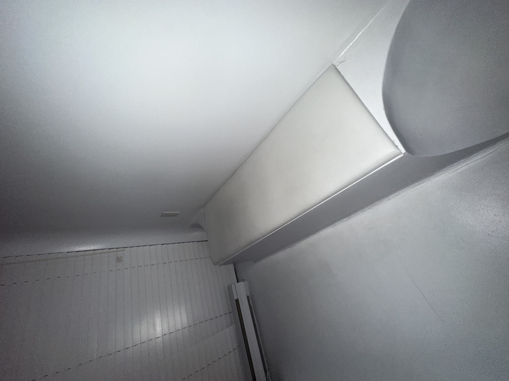
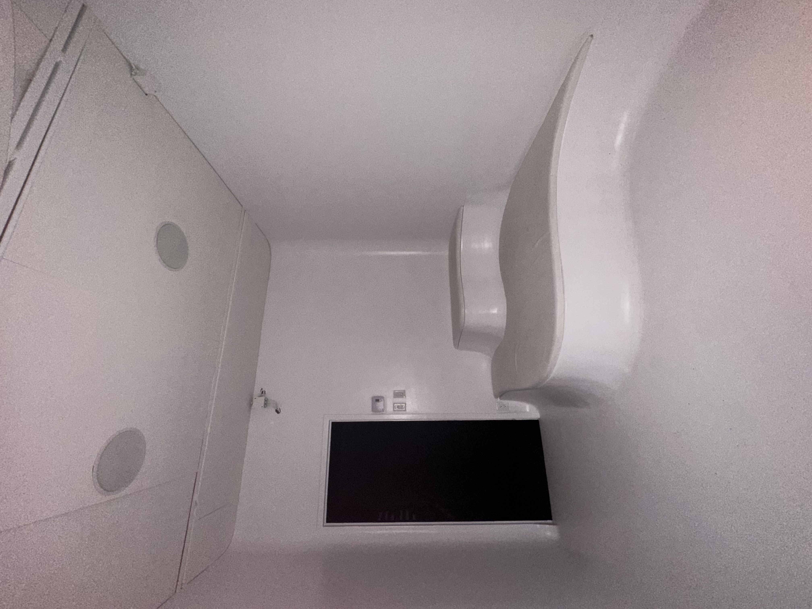
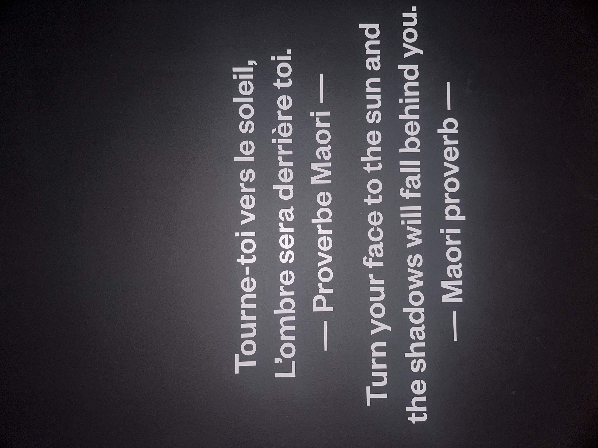

 ## Introduction
 ### Dispositif + expérience
 
 Interressant, Jeu de Mystere, ambiance
 
 
 
  Source: Ma photo

 ### Les points
- Les informations de l'oeuvre et de son fonctionnement.
  
 ## Développement
 Infos sur le lieu, Date de votre visite)
 
- Titre: SunRoom 

- Artistes: Adam Hummell et Kelly Nunes 

- Année Réalisation: 

- Nom Exposition: Centre Age Of Union

- Type Exposition: Interactif

- Lieu de mise en exposition: 7049 rue St-Urbain, Montreal

- Infos: Située dans le quartier de la Petite Italy, le Centre vise à mobiliser le public aux enjeux environnementaux et à la crise climatique actuelle.
  
- Date Visite: 2 mars, journee gratuite
  
- Description:

- Type d'installation: Interieur

- Mise en espace

- Composantes éléments:
  
 #### Lumière Led orange 
 

#### Petits écrans visible

#### Support et Câbles électriques

#### Bancs

Source: Mes photos

- Expérience vécue

- Appréciation
  
- Idées
  
 ## Conclusion 
 
 Rappel: Plus d'informations, avoir de l'aide, pas vraiment aimé
 
 Ouverture: Me fait rappeler à l'oeuvre de Canevas Cosmique dans l'exposition de Cresentia
 
 Lien: Soleil avec des planètes. 

 
