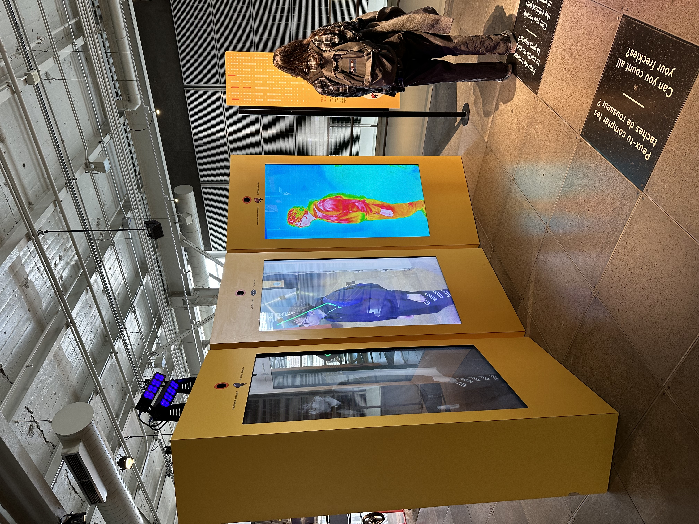

# Centre des sciences

## Nom de l'exposition
Le nom de l'exposition est Centre des sciences Montreal.

## Lieu de mise en exposition
Le lieu de mise en exposition est au Fondation du Centre des sciences Montreal.

## Type d'exposition
Le type d'exposition est a l'interieur. 

## Date de la visite
La date de la visite etait le 10 avril 2024.

## Titre de l'oeuvre
Le titre de l'oeuvre est Voir Invisible.

## Nom de l'artiste
Le nom de l'artiste est  . 

## Année de réalisation 
L'année de la réalisation est en 2000, mais en 2002, le nom est changé en Centre des sciences de Montréal. 

## Description de l'oeuvre
Le Centre des sciences de Montréal est un musée scientifique situé à Montréal, au Québec, et est une division de la Société immobilière du Canada1. Il est voué à la vulgarisation scientifique, à la promotion du savoir et au développement de la culture scientifique et technique. Il a pour mandat d’aider les visiteurs de tous âges à découvrir, à mieux comprendre et à s’approprier la science et la technologie pour bâtir leur avenir. Il se trouve sur l'emplacement d'anciens hangars maritimes au quai King-Edward, dans le Vieux-Port de Montréal.

Source: https://fr.wikipedia.org/wiki/Centre_des_sciences_de_Montr%C3%A9al

## Type d'installation 
Le type d'installation est interactif.

Ma source: Ma photo

## Mise en espace

## Composantes et techniques

## Éléments nécessaires à la mise en exposition

## Expérience vécue

## ❤️ Ce qui vous a plu, vous a donné des idées

## 🤔 Aspect que vous ne souhaiteriez pas retenir pour vos propres créations ou que vous feriez autrement
