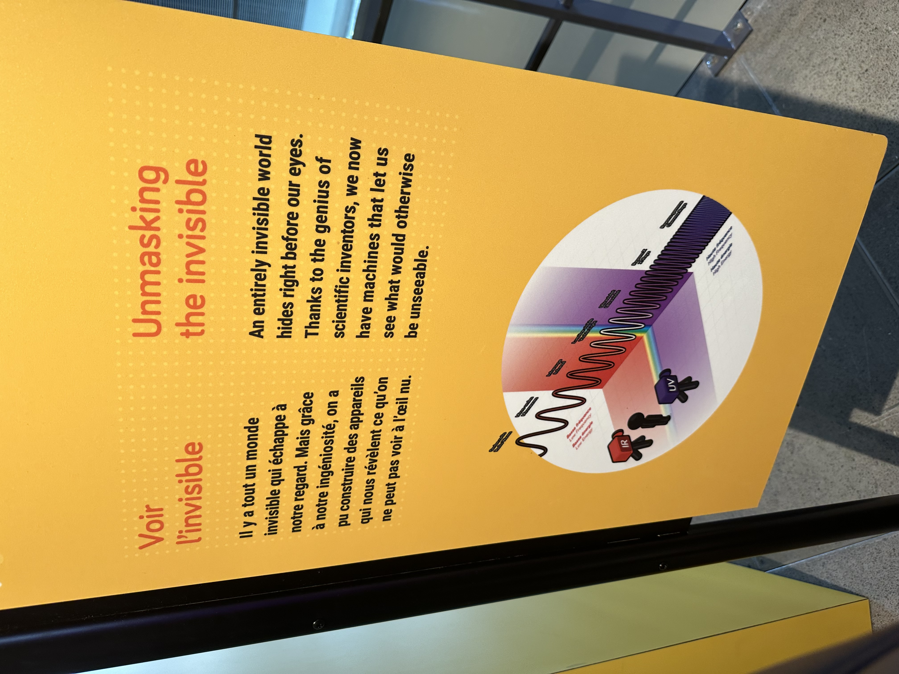
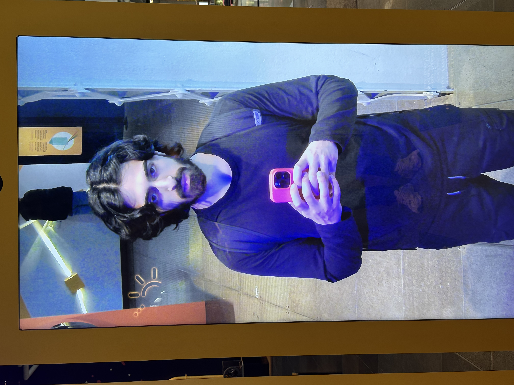
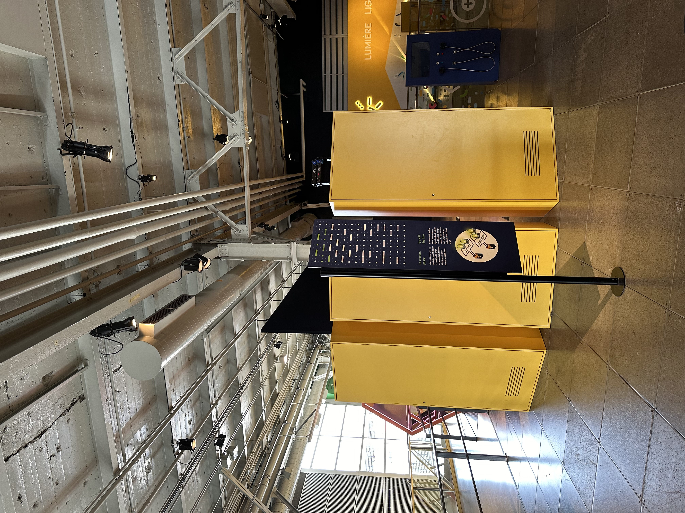
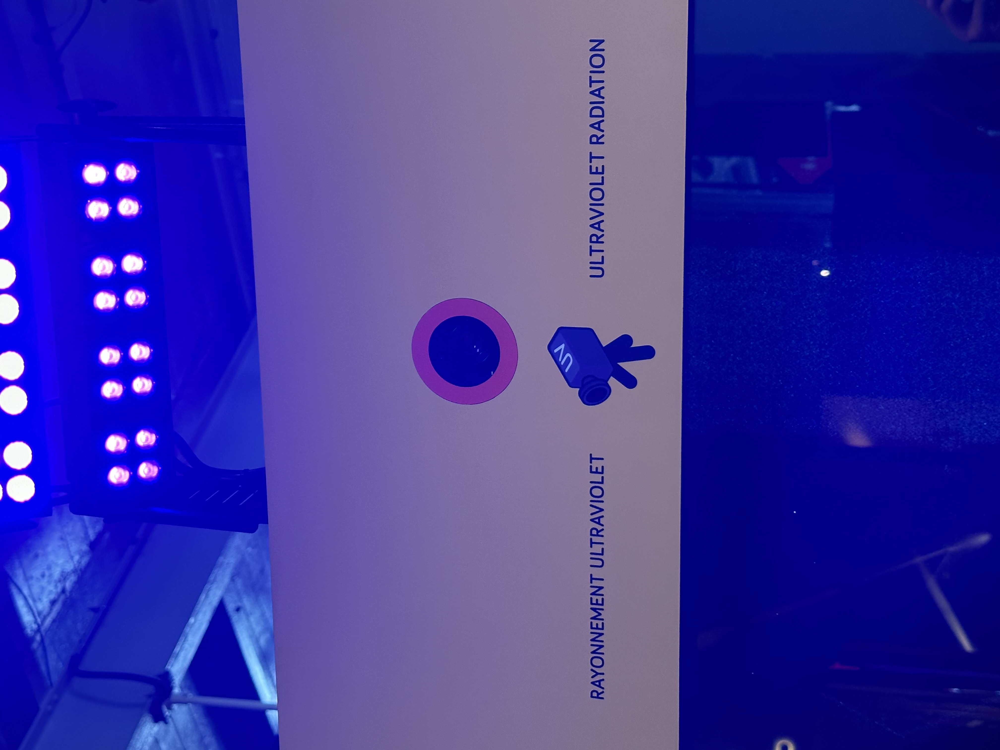
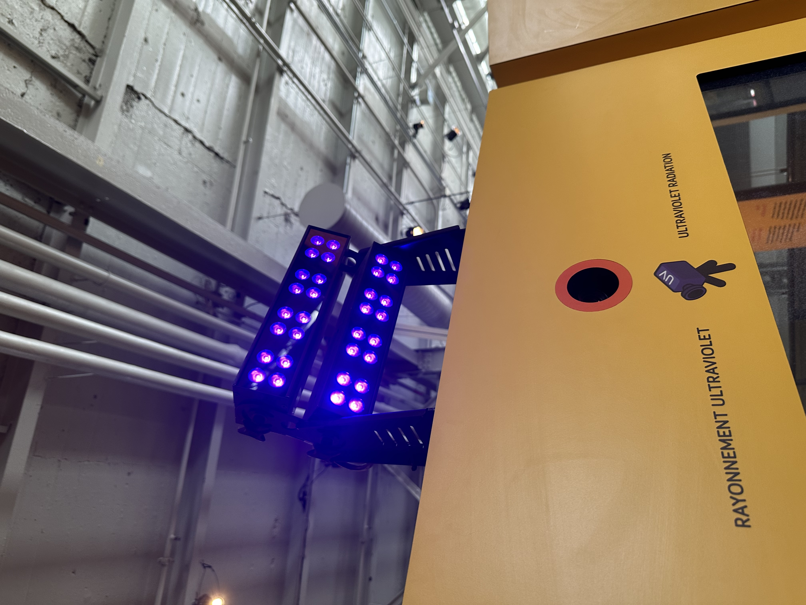
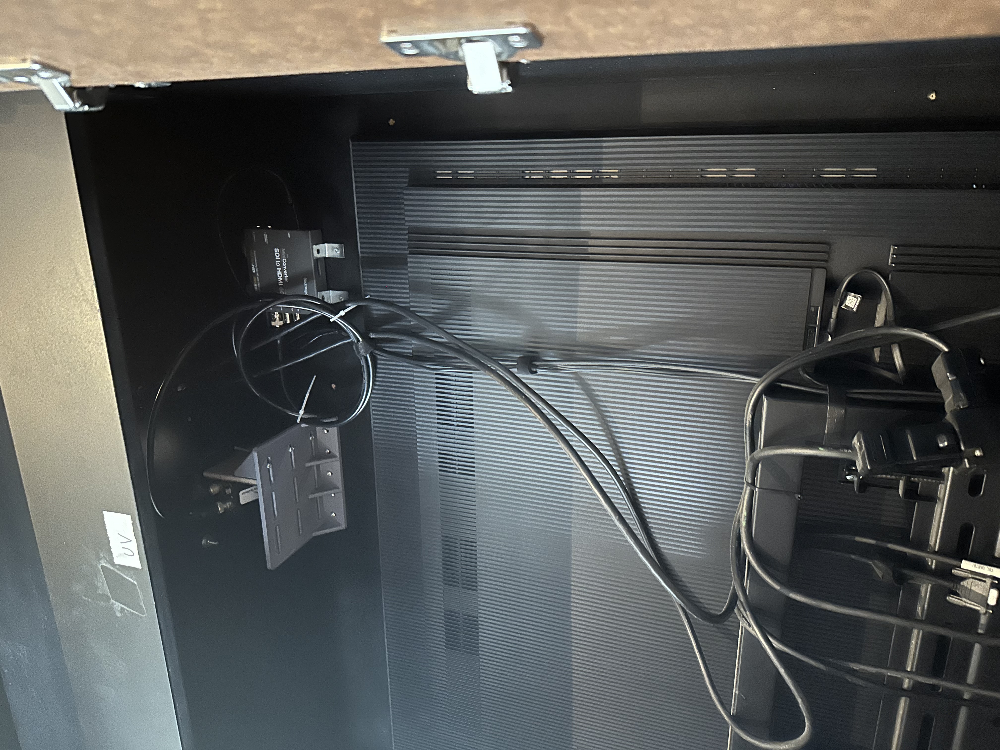
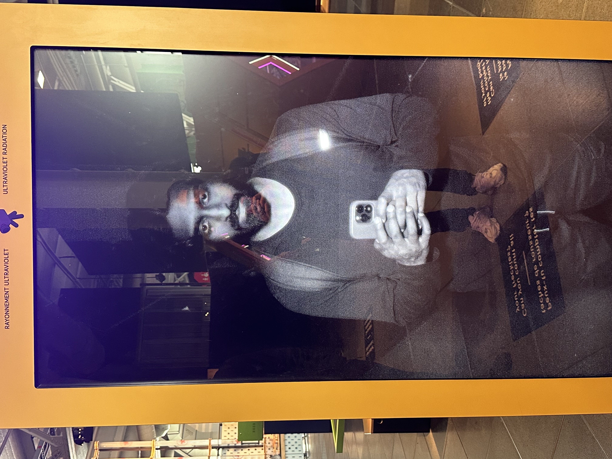

# Centre des sciences

## Nom de l'exposition
Le nom de l'exposition est Centre des sciences Montréal.

## Lieu de mise en exposition
Le lieu de mise en exposition est au Fondation du Centre des sciences Montréal.

## Type d'exposition
Le type d'exposition est à l'intérieur. 

## Date de la visite
La date de la visite était le 10 avril 2024.

## Titre de l'oeuvre
Le titre de l'oeuvre est Voir l'nvisible.

- ### Source: Ma photo
  
## Nom de l'artiste
Le nom de l'artiste est  . 

## Année de réalisation 
L'année de la réalisation est en 2000, mais en 2002, le nom est changé en Centre des sciences de Montréal. 

## Description de l'oeuvre
Il y a tout un monde invisible qui échappe à notre regard. Mais grâce à notre ingéniosité, on a pu construire des appareils qui nous révèlent ce qu'on ne peut pas voir à l'œil nu.

- ### Source: Ma photo

## Type d'installation 
Le type d'installation est interactif.

Ma source: Ma photo

## Fonction du dispositif multimédia
Pour bien appréhender l'œuvre, il y a trois écrans, chacun proposant un effet différent. Il faut se positionner devant chaque écran pour observer son effet.

- Trois écrans
   

Ma source: Ma photo

## Mise en espace
Pour la disposition de l'espace, celui-ci est relativement restreint, occupant environ 3 mètres. Il est positionné sur le côté plutôt que directement en face, et chaque écran est équipé d'une caméra. De plus, de petites consignes sont inscrites sur le sol.

- Consigne
  

Ma source: Ma photo

- Espace
  

Ma source: Ma photo

## Composantes et techniques
Les composantes et les techniques utilisés comprennent des caméras à l'intérieur des trois écrans, ainsi que des lumières vives suspendues au plafond.

- Lumières

Ma source: Ma photo

- Caméra

Ma source: Ma photo

## Éléments nécessaires à la mise en exposition
Les éléments nécessaires à la mise en exposition comprennent un projecteur pour l'écran visible, des câbles pour chaque écran et des caches-fils dissimulés dans le sol.

- Projecteur
  

Ma source: Ma photo

- Les cables
  

Ma source: Ma photo

## Expérience vécue
Avant de débuter l'exposition, nous avons été accueillis par une guide qui nous a présenté les différentes œuvres. Elle nous a expliqué leur fonctionnement. Ensuite, un monsieur nous a guidés vers les œuvres les plus intéressantes, nous montrant leur fonctionnement et leur emplacement. Lorsque nous sommes arrivés à l'œuvre qui m'intéressait, je me suis placé devant chacun des trois écrans pour observer les effets. Chaque écran proposait un effet différent. Enfin, vers la fin de la visite, il nous a conduits dans la salle de contrôle et nous a montré comment ils supervisent les expositions.

- Effet de du premier écran

Ma source: Ma photo

## ❤️ Ce qui vous a plu, vous a donné des idées
Ce qui m'a plu durant l'exposition, c'était qu'une fois devant l'écran de radiation et qu'il fallait toucher une partie de mon corps, cela montrait à l'écran les parties de mon corps qui avaient été touchées. J'ai trouvé cela très agréable et créatif. Cela m'a donné une idée de comment je pourrais procéder si je veux réaliser un projet sur l'être humain. Par exemple, une fois devant l'écran, on pourrait voir ce qui se passe à l'intérieur de ton corps, comme un scanner CT. 

## 🤔 Aspect que vous ne souhaiteriez pas retenir pour vos propres créations ou que vous feriez autrement
L'aspect que je ne souhaiterais pas retenir est l'emplacement de l'œuvre. Je n'ai pas aimé la façon dont l'œuvre a été placée au Centre des sciences. J'aurais aimé qu'elle soit placée au milieu, car elle a été reléguée sur le côté. Une fois devant l'écran de radiation, qui était le dernier de la série, il fallait contourner l'endroit pour accéder à une autre œuvre. 

- L'emplacement de l'oeuvre
  

Source: Ma photo

